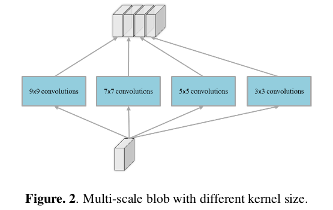
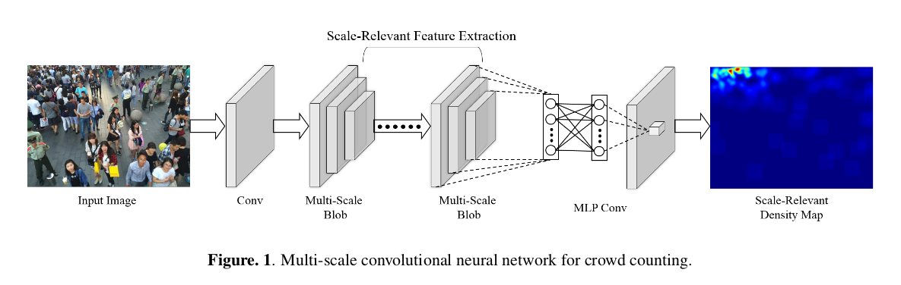
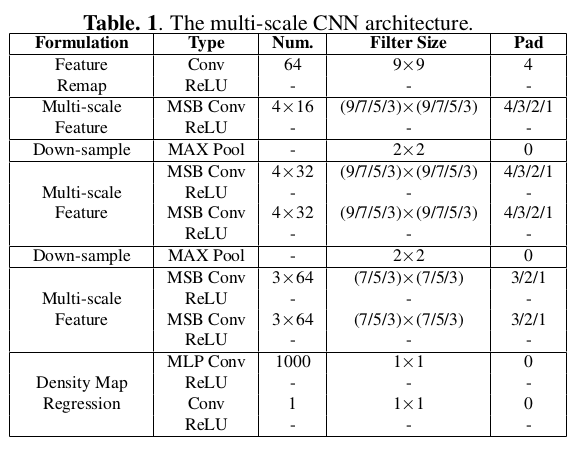
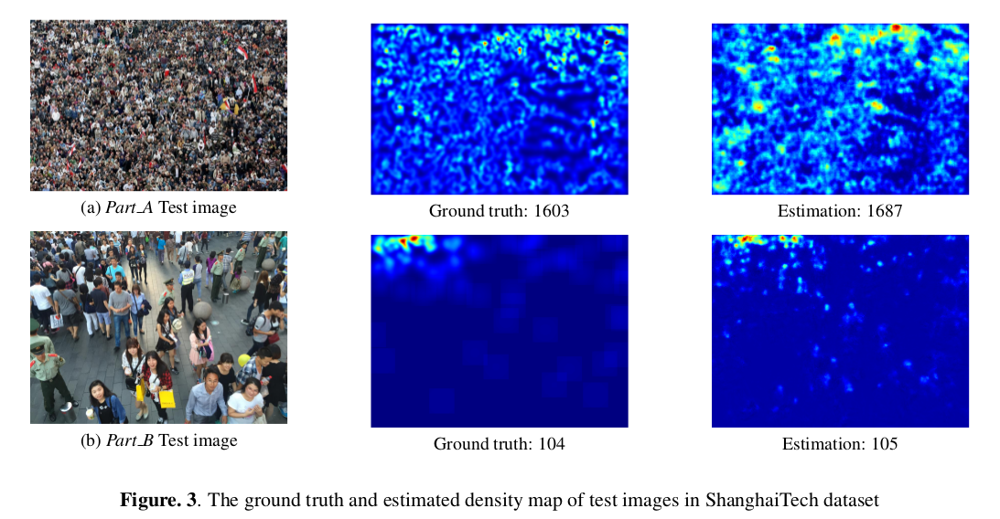
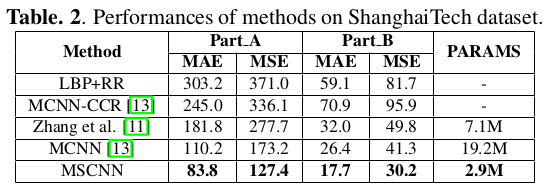
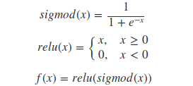

>>>>>>> HEAD

# mscnn crowd counting model
=======
[](LICENSE)
## Introduction

This is open source project for crowd counting. Implement with paper "Multi-scale Convolution Neural Networks for Crowd Counting" write by Zeng L, Xu X, Cai B, et al.  For more details, please refer to our [arXiv paper](https://arxiv.org/abs/1702.02359)

<p align="center">

</p>
<p align="center">

</p>
<p align="center">

</p>
<p align="center">

</p>
<p align="center">

</p>


### Contents
1. [Installation](#installation)
2. [Preparation](#preparation)
3. [Train/Eval](#traineval)
4. [Details](#details)

### Installation
1. Configuration requirements
```
python3.x

Please using GPU, suggestion more than GTX960

python-opencv
#tensorflow-gpu==1.0.0
#tensorflow==1.0.0
matplotlib==2.2.2
numpy==1.14.2

conda install -c https://conda.binstar.org/menpo opencv3
pip install -r requirements.txt
```
2. Get the code
```
git clone https://github.com/Ling-Bao/mscnn
cd mscnn
```
### Preparation
1. ShanghaiTech Dataset. 
ShanghaiTech Dataset makes by Zhang Y, Zhou D, Chen S, et al. For more detail, please refer to paper "Single-Image Crowd Counting via Multi-Column Convolutional Neural Network" and click on [here](https://www.cv-foundation.org/openaccess/content_cvpr_2016/papers/Zhang_Single-Image_Crowd_Counting_CVPR_2016_paper.pdf).

2. Get dataset and its corresponding map label
[Baidu Yun](https://pan.baidu.com/s/12EqB1XDyFBB0kyinMA7Pqw) 
Password: sags

3. Unzip dataset to mscnn root directory
```
 tar -xzvf  Data_original.tar.gz
```

### Train/Eval
Train is easy, just using following step.

1. Train. Using [mscnn_train.py](mscnn_train.py) to evalute mscnn model
```
python mscnn_train.py
```

2. Eval. Using [mscnn_eval.py](mscnn_eval.py) to evalute mscnn model
```
python mscnn_eval.py
```

### Details
1. Improving model structure. Add Batch Normal after each convolution layer.

2. Improving activation funtion for last layer to adapt crowd counting map estimation.
<p align="center">

</p>

=======
[](LICENSE)
>>>>>>> TAIL
